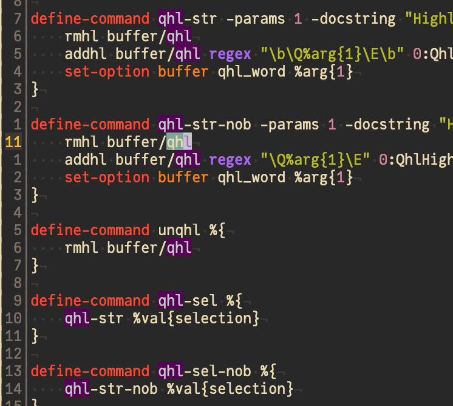

# quick-highlight



This is a kakoune plugin for highlighting all occurences of your selection in the document. The plugin provides the following commands:

* `:qhl-word`: Highlights all occurences of the word under the cursor.
* `:qhl-sel`: Highlights all occurences of the main selection.
* `:qhl-sel-nob`: Same as the above, but ignores word boundaries.
* `:unqhl`: Removes the highlight.

The package also registers the face `QhlHighlight`, which defaults to the color `#55055`, a dark purple.

Recommended bindings are
```
map global user '&' ':qhl-word<ret>' -docstring "Highlight current word"
map global user '"' ':unqhl<ret>' -docstring "Remove highlight"
```

